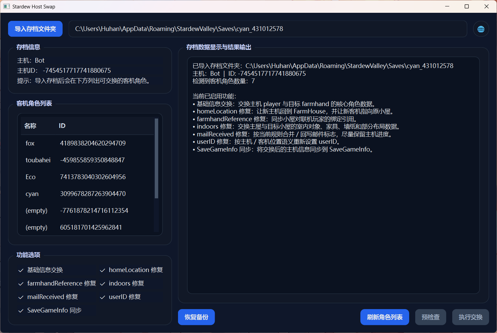

# stardew-host-swap

[English](README_EN.md) | 中文

一个用于 **《星露谷物语》1.6 版本多人联机存档主客身份互换** 的 Python 工具。

当前项目实现了：  
将联机存档中的某个客机角色与主机角色互换，同时尽量保留角色数据、存档预览信息，以及修复一部分关键的玩家归属关系与房屋内部内容。

## 开源协议

本项目采用 **MIT License** 开源。

---

## 简介

《星露谷物语》的联机存档中：

- 主机玩家位于存档文件的 `SaveGame/player` 节点下
- 联机客机位于存档文件的 `SaveGame/farmhands/Farmer` 节点下

从存档结构上看，主机和客机虽然都属于 `Farmer` 类型，但并不是简单的“改个名字就能互换”。  
直接交换节点后，往往还会遇到：

- `SaveGameInfo` 预览信息不一致
- `mailReceived` 导致的进度缺失
- `homeLocation` 未修正导致联机角色列表不显示
- `userID` 绑定问题
- `farmhandReference` 归属引用未同步
- Cabin / 主屋的 `indoors` 内容没有随角色正确迁移

这个项目就是为了解决这些问题而写的。

---

## 当前功能

当前版本支持以下内容：

- 交换主存档中 `player` 与指定 `farmhands/Farmer` 的角色数据
- 同步修复 `SaveGameInfo`
- 修复 `mailReceived`
- 修复 `homeLocation`
- 修复 `userID`
- 修复部分基于 `UniqueMultiplayerID` 的归属字段：
  - `farmhandReference`
- 交换并修复角色对应房屋的 `indoors` 内容
- 支持 **预检查 / 报告模式**
- 支持直接传入 **存档文件夹路径**
- 支持 **原地修改原存档文件**
- 自动创建 `_bak` 备份文件
- 提供 **PySide6 图形界面**
- 支持 **整个窗口拖放导入存档文件夹**
- 支持 **中英文界面切换**
- 支持 **恢复 `_bak` 备份**

---

## 软件截图



---

## 使用方法

#### 1. 启动 GUI

```bash
python main.py
```

#### 2. 导入存档

可以使用以下任一方式：

- 点击“导入存档文件夹”按钮选择目录
- 直接将存档文件夹拖放到窗口任意位置

Windows 下存档通常位于：

```text
%appdata%\StardewValley\Saves
```

典型存档目录结构如下：

```text
name_123456789/
  name_123456789
  SaveGameInfo
```

#### 3. 选择客机角色

导入完成后，界面会显示：

- 当前主机名称与 ID
- 可交换的客机角色列表（双列显示：名称 / ID）

在左侧角色列表中选中一个需要与主机交换的客机角色。

#### 4. 选择功能选项

当前 GUI 中可配置的选项包括：

- 基础信息交换（必选）
- `homeLocation` 修复
- `farmhandReference` 修复
- `indoors` 修复
- `mailReceived` 修复
- `userID` 修复
- `SaveGameInfo` 同步

其中：

- `indoors` 修复当前已接入实际逻辑，默认勾选
- 右侧输出框会显示当前已勾选功能的说明，便于确认实际执行内容

#### 5. 预检查

点击“预检查”按钮后，右侧输出区域会显示：

- 当前主机 / 客机信息
- 将启用的修复项
- 预期的修改内容
- 将创建的 `_bak` 备份文件

#### 6. 执行交换

点击“执行交换”按钮后，会先弹出确认框。确认后程序将：

- 备份原主存档为：`原文件名_bak`
- 备份 `SaveGameInfo` 为：`SaveGameInfo_bak`
- 将选定客机角色与主机角色进行交换
- 根据当前勾选的功能执行对应修复
- 将修改后的内容直接写回原存档文件

#### 7. 恢复备份

如果需要回滚，可点击“恢复备份”按钮。  
该操作会用对应的 `_bak` 文件覆盖当前存档，并在恢复完成后删除这些 `_bak` 文件。

---

## 运行逻辑

当前版本的处理流程大致如下：

1. 读取主存档 XML，找到：
   - `SaveGame/player`
   - 目标 `SaveGame/farmhands/Farmer`

2. 使用 **原始 XML 文本级别** 的方式，交换：
   - `player` 节点内部内容
   - 指定 `Farmer` 节点内部内容

3. 在交换完成后，根据当前启用的功能，对以下字段做定点修复：
   - `mailReceived`
   - `homeLocation`
   - `userID`

4. 同步修复部分归属引用：
   - `farmhandReference`

5. 如启用 `indoors` 修复，则同步交换角色对应房屋的室内内容

6. 将交换后的 `player` 内容同步写入 `SaveGameInfo/Farmer`

7. 在写回前自动备份原文件为 `_bak`

---

## 技术实现

<details>
<summary>点击展开</summary>

### 1. 玩家主要数据交换方式

主体交换并不是整棵树重建，而是：

- 找到 `<player>...</player>` 的内部区间
- 找到目标 `<Farmer>...</Farmer>` 的内部区间
- 直接交换这两段内部 XML 内容

### 2. SaveGameInfo 的同步方式

`SaveGameInfo` 的根节点是 `Farmer`，并且通常带有：

- `xmlns:xsi`
- `xmlns:xsd`

当前实现不会替换根标签，也不会改这两个命名空间声明，  
只会把交换后主存档中的 `player` 内部内容，覆盖到 `SaveGameInfo/Farmer` 的内部内容。

### 3. mailReceived 的处理策略

当前采用的是“保主机进度优先”的策略：

- 新主机：`原客机 mailReceived ∪ 原主机 mailReceived`
- 新客机：保留原主机的 `mailReceived`

这样做是因为主机的 `mailReceived` 中存有全局进度标志，尽量避免主机切换后丢失全局进度标志。

### 4. homeLocation 的处理策略

测试表明，如果主机交换为客机后仍保留：

```xml
<homeLocation>FarmHouse</homeLocation>
```

那么它在联机角色选择列表中可能不会显示。

因此当前修复规则为：

- 新主机：`homeLocation = FarmHouse`
- 新客机：`homeLocation = 目标客机交换前原本的小屋 location`

### 5. userID 的处理策略

当前按“位置语义”处理：

- 新主机：`userID = 空`
- 新客机：恢复为目标客机交换前的 `userID`

### 6. farmhandReference 的处理方式

当前版本会对以下标签做双向 ID 替换：

- `farmhandReference`

逐个命中标签值，按原值判断：

- 原值是旧主机 ID → 写成旧客机 ID
- 原值是旧客机 ID → 写成旧主机 ID

### 7. indoors 修复

当前版本已实现 `indoors` 内容交换。  
在主机 / 客机身份交换后，可以同步迁移双方对应房屋的室内内容，以使角色数据与房屋内部布局、物品内容保持更一致。

### 8. 写入策略

- 先备份主存档为 `原文件名_bak`
- 如果存在 `SaveGameInfo`，先备份为 `SaveGameInfo_bak`
- 再将修改后的内容写回原文件名

这样在测试失败时，可以直接用备份文件回滚。

</details>

---

## 注意事项

### 1. 工具会自动备份，但仍建议手动备份整个存档文件夹

当前版本会自动创建 `_bak` 文件，但在涉及重要存档时，仍然建议手动额外备份整个存档文件夹。

### 2. 该工具属于实验性工具

仅在 1.6.15 版本进行了多轮测试，该项目更适合作为：

- 个人使用工具
- 针对原版或较少模组环境的实验性工具

如果你的存档使用了大量模组，可能还会存在：

- 自定义字段未同步
- 额外 world/player 绑定未覆盖

### 3. 并非所有问题都已完全解决

当前工具重点解决的是：

- 角色主体互换
- 角色可见性
- 基础进度同步
- 一部分归属关系
- 房屋室内内容随角色迁移

但还没有覆盖所有可能的多人 / 模组边角情况。

---

## 已知限制

- 尚未系统处理所有可能的 `UniqueMultiplayerID` 引用字段
- 尚未专门适配模组自定义节点
- 尚未对所有版本差异做兼容层

---

## 建议的使用流程

推荐按下面顺序通过 GUI 操作：

1. 启动 `gui_main.py`
2. 通过按钮或拖放方式导入存档文件夹
3. 在左侧角色列表中选择需要交换的客机角色
4. 确认功能复选框设置是否符合预期，尤其是 `indoors` 修复是否按需启用
5. 点击“预检查”，阅读右侧输出区域中的报告和已启用功能说明
6. 确认无误后点击“执行交换”，并在确认弹窗中继续
7. 进入游戏测试：
   - 是否能正常载入
   - 主机角色是否正确
   - 原主机是否出现在联机角色列表
   - 房屋和归属是否符合预期
   - 室内物品与布局是否符合预期
8. 如出现问题，可点击“恢复备份”回滚，或手动使用 `_bak` 文件恢复

---

## 免责声明

本项目为非官方工具。  
使用前请务必自行备份存档。  
因存档损坏、角色异常、联机问题或模组兼容问题造成的损失，使用者需自行承担风险。

---

## 开发方式说明

本项目开发过程中使用了 AI 辅助工具。  
AI 参与了部分代码生成、重构、问题排查与文档编写工作。

为保证可用性，所有实际功能均经过人工测试与验证后发布。
