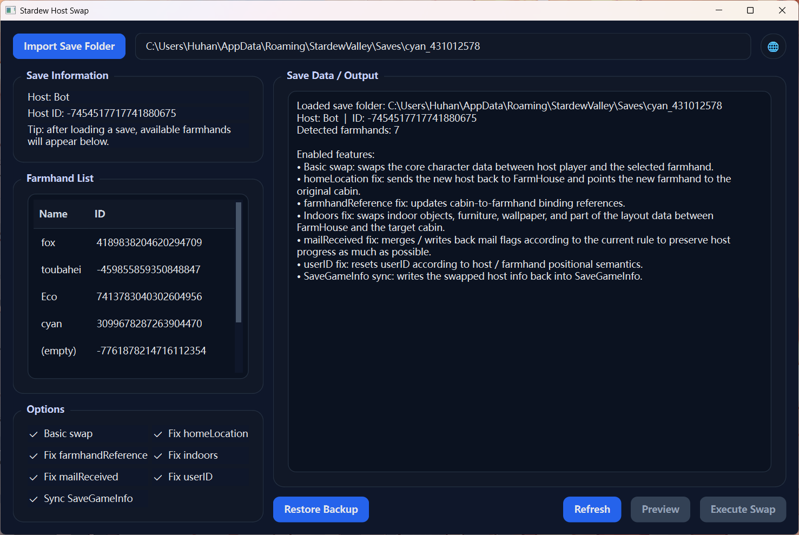

# stardew-host-swap

English | [中文](README.md)

A Python tool for **swapping host and farmhand identities in Stardew Valley 1.6 multiplayer saves**.

The current project implements:  
Swapping a selected farmhand character with the host character in a multiplayer save, while preserving as much player data, save preview information, and key ownership relationships and indoor house content as possible.

## License

This project is released under the **MIT License**.

---

## Overview

In Stardew Valley multiplayer saves:

- The host player is located under the `SaveGame/player` node
- Farmhand players are located under the `SaveGame/farmhands/Farmer` nodes

From the save structure perspective, although both host and farmhands are of type `Farmer`, they are **not** interchangeable by simply renaming or moving nodes.  
After a direct swap, you will often run into issues such as:

- Inconsistent `SaveGameInfo` preview data
- Progress loss caused by `mailReceived`
- Missing multiplayer character selection entries due to incorrect `homeLocation`
- `userID` binding issues
- Unsynchronized ownership references such as `farmhandReference`
- Cabin / farmhouse `indoors` content not being migrated correctly with the player

This project was written to address those problems.

---

## Current Features

The current version supports:

- Swapping the `player` in the main save with a specified `farmhands/Farmer`
- Synchronizing and fixing `SaveGameInfo`
- Fixing `mailReceived`
- Fixing `homeLocation`
- Fixing `userID`
- Fixing part of the ownership fields based on `UniqueMultiplayerID`:
  - `farmhandReference`
- Swapping and fixing the corresponding house `indoors` content
- Supporting **pre-check / report mode**
- Supporting direct input of the **save folder path**
- Supporting **in-place modification of the original save files**
- Automatically creating `_bak` backup files
- Providing a **PySide6 GUI**
- Supporting **drag-and-drop of save folders anywhere in the window**
- Supporting **Chinese / English UI switching**
- Supporting **restoring from `_bak` backups**

---

## Screenshot



---

## Usage

#### 1. Launch the GUI

```bash
python main.py
```

#### 2. Import a save

You can load a save folder in either of these ways:

- Click the **Import Save Folder** button
- Drag the save folder anywhere into the application window

On Windows, Stardew Valley saves are usually located in:

```text
%appdata%\StardewValley\Saves
```

A typical save directory looks like this:

```text
name_123456789/
  name_123456789
  SaveGameInfo
```

#### 3. Select a farmhand character

After loading the save, the GUI shows:

- The current host name and ID
- A farmhand list with two columns: **Name / ID**

Select the farmhand character you want to swap with the host.

#### 4. Configure options

The GUI currently provides these toggleable options:

- Basic swap (required)
- `homeLocation` fix
- `farmhandReference` fix
- `indoors` fix
- `mailReceived` fix
- `userID` fix
- `SaveGameInfo` sync

Notes:

- The `indoors` fix is now fully connected to actual logic and is enabled by default
- The right-side output panel shows a summary of the currently enabled functions for easier verification

#### 5. Run a preview

Click **Preview** to display:

- Current host / farmhand information
- Enabled fixes
- Planned changes
- The `_bak` files that will be created before writing

#### 6. Perform the swap

Click **Execute Swap**. A confirmation dialog will appear first.  
After confirmation, the program will:

- Back up the original main save as `original_filename_bak`
- Back up `SaveGameInfo` as `SaveGameInfo_bak`
- Swap the selected farmhand with the host
- Execute the fixes corresponding to the currently enabled options
- Write the modified content back to the original save files

#### 7. Restore backups

If you want to roll back the changes, click **Restore Backup**.  
This will overwrite the current save files with the corresponding `_bak` files and then delete those `_bak` files after restoration.

---

## Processing Logic

The current processing flow is roughly:

1. Read the main save XML and locate:
   - `SaveGame/player`
   - The target `SaveGame/farmhands/Farmer`

2. Use an **original XML text-level** approach to swap:
   - The internal content of the `player` node
   - The internal content of the specified `Farmer` node

3. After the swap, apply targeted fixes according to the currently enabled options:
   - `mailReceived`
   - `homeLocation`
   - `userID`

4. Synchronize some ownership references:
   - `farmhandReference`

5. If `indoors` fix is enabled, also swap the indoor house content corresponding to the two players

6. Write the swapped `player` content into `SaveGameInfo/Farmer`

7. Automatically back up the original files as `_bak` before writing changes

---

## Technical Details

<details>
<summary>Click to expand</summary>

### 1. Main player data swap strategy

The core swap does not rebuild the entire XML tree. Instead, it:

- Locates the inner range of `<player>...</player>`
- Locates the inner range of the target `<Farmer>...</Farmer>`
- Directly swaps those two chunks of inner XML

### 2. SaveGameInfo synchronization strategy

The root node of `SaveGameInfo` is `Farmer`, and it usually contains:

- `xmlns:xsi`
- `xmlns:xsd`

The current implementation does not replace the root tag and does not modify those namespace declarations.  
It only replaces the inner content of `SaveGameInfo/Farmer` with the swapped `player` content from the main save.

### 3. mailReceived strategy

The current implementation prioritizes preserving host progress:

- New host: `old_farmhand_mailReceived ∪ old_host_mailReceived`
- New farmhand: keeps the original host `mailReceived`

This is because the host `mailReceived` may contain global progress flags, and this strategy reduces the chance of losing global progress after the swap.

### 4. homeLocation strategy

Testing showed that if the downgraded original host still keeps:

```xml
<homeLocation>FarmHouse</homeLocation>
```

it may not appear correctly in the multiplayer character selection list.

So the current fix is:

- New host: `homeLocation = FarmHouse`
- New farmhand: `homeLocation = the original cabin location of the target farmhand before the swap`

### 5. userID strategy

The current implementation follows a position-based semantic rule:

- New host: `userID = empty`
- New farmhand: restores the original `userID` of the target farmhand before the swap

### 6. farmhandReference strategy

The current version performs a two-way ID swap on:

- `farmhandReference`

It checks each matched tag value and swaps based on the original value:

- Old host ID → old farmhand ID
- Old farmhand ID → old host ID

### 7. indoors fix

The current version implements `indoors` content swapping.  
After the host / farmhand identity swap, it can also migrate the interior content of the corresponding houses so that player data and indoor layout / items stay more consistent.

### 8. Write strategy

- Back up the main save as `original_filename_bak`
- If `SaveGameInfo` exists, back it up as `SaveGameInfo_bak`
- Write the modified content back to the original file names

This makes rollback possible if testing fails.

</details>

---

## Notes

### 1. The tool creates backups automatically, but manual backup is still recommended

The current version automatically creates `_bak` files, but for important saves it is still recommended to manually back up the entire save folder as well.

### 2. This tool is experimental

It has only been tested repeatedly on version 1.6.15, and is best suited for:

- Personal use
- Vanilla or lightly modded save files

If your save uses many mods, there may still be issues such as:

- Unsynchronized custom fields
- Uncovered extra world / player bindings

### 3. Not every issue is fully solved yet

The current tool mainly focuses on:

- Core player identity swapping
- Character visibility
- Basic progress preservation
- Part of the ownership relationships
- Indoor house content migration with the player

It does not yet cover every multiplayer / mod edge case.

---

## Known Limitations

- Not all possible `UniqueMultiplayerID` reference fields are handled yet
- Mod-specific custom nodes are not specially supported yet
- No full compatibility layer for every save format variation yet

---

## Recommended Workflow

Recommended GUI workflow:

1. Start `gui_main.py`
2. Import the save folder using the button or by dragging it into the window
3. Select the farmhand character you want to swap in the left-side list
4. Confirm that the option checkboxes match what you want, especially whether `indoors` fix should be enabled
5. Click **Preview** and read the report and enabled function summary in the right output panel
6. If everything looks correct, click **Execute Swap** and confirm the dialog
7. Test the save in-game:
   - Does it load successfully?
   - Is the host character correct?
   - Does the old host appear in the multiplayer character selection list?
   - Are housing and ownership relationships correct?
   - Are interior items and layouts correct?
8. If something goes wrong, use **Restore Backup** or manually restore from the `_bak` files

---

## Disclaimer

This project is an unofficial tool.  
Please back up your saves before using it.  
The user assumes all risks for any save corruption, character issues, multiplayer issues, or mod compatibility problems caused by using this tool.

---

## Development Notes

This project was developed with AI-assisted tooling.  
AI contributed to parts of the code generation, refactoring, issue investigation, and documentation writing.

To ensure usability, all released functionality was manually tested and verified before release.
